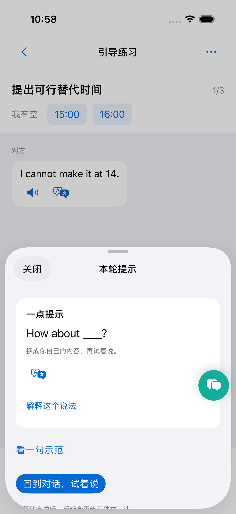
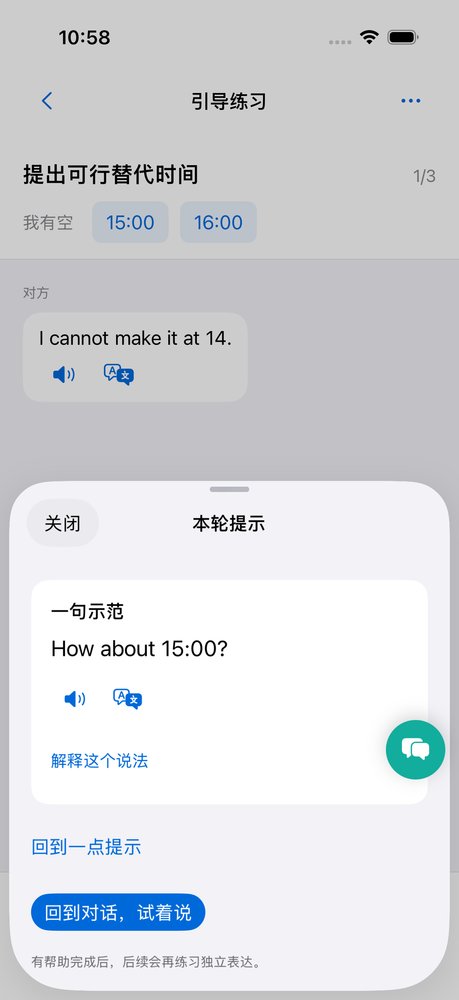

# 本轮提示

- 一张卡片，默认给一个当前回应相关的句型；进一步查看一句示范。
- 示范可播放；翻译及短解释按需展开；本课表达移至更多菜单。
- 依据最新对话刷新缓存；只使用学习者可见信息。提示使用记录保存级别及对应发言。
- 后端新增 HintContent，作为 DialogueResponse.hint_content 传给 iOS；保留旧提示枚举以兼容旧客户端。
- 结构错误、多句型及示范未填空白会触发修复，仍不合法则提示重试。

## 验证

后端完整测试及提示专项测试通过；隔离模拟器验证句型、示范、翻译、解释与返回对话，截图使用测试数据。DeepSeek 线上生成得到一句带空白的句型和一句填入本人时间的完整示范。未改写用户历史或能力状态。

