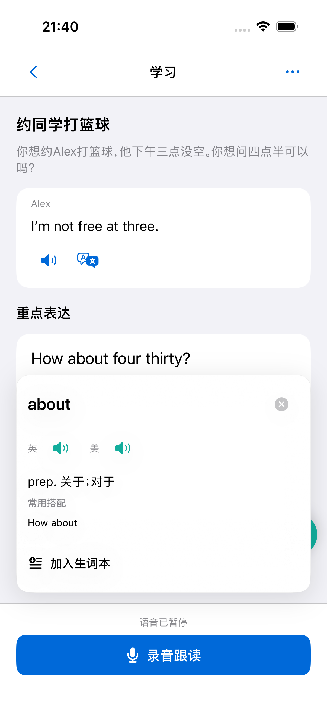
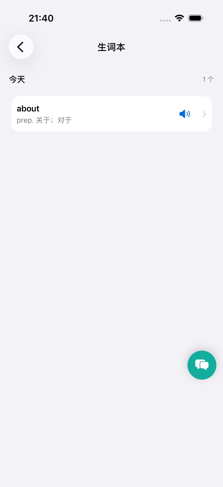
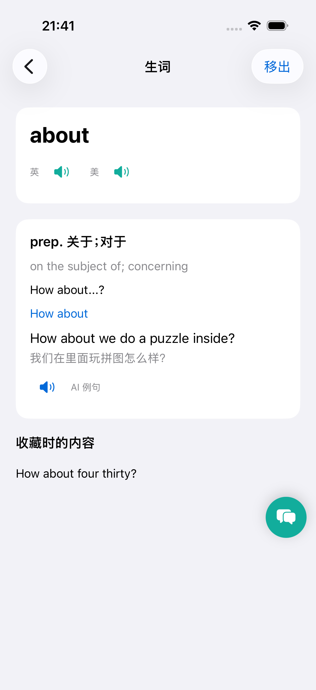

# 全局查词与生词本

## 页面与操作

沿用旧版 iOS 的查词卡片和日期分组生词本；学习、引导、独立、复习、提示、示范、反馈及生词详情中的英文词均可点击。可编辑输入框保留正常的文字编辑操作。

```text
英文句子：Are you available tomorrow?
                 ↓ 点击 available
┌─────────────────────────────┐
│ available                ×  │
│ 英 /音标/ 🔊   美 /音标/ 🔊  │
│ adj. 可用的；有空的          │
│ ─────────────────────────── │
│ ＋ 加入生词本／✓ 已在生词本  │
└─────────────────────────────┘
```

浮动卡片靠近所点的词，可关闭或点外部关闭；内容较长时卡片内滚动。查词时暂停课程音频，录音保留供回听或重录。释义加载失败可重试；保存失败保留卡片，不显示保存成功。

```text
我的 → 生词本
┌ 今天 ─────────────── 2 个 ┐
│ available /音标/     🔊  › │
│ adj. 有空的；可用的       │
│ careful /音标/       🔊  › │
│ adj. 小心的               │
└───────────────────────────┘
点词条 → 生词详情
┌ 生词 ────────────── 移出 ┐
│ available                 │
│ 英美音标与发音            │
│ 词义 → 搭配 → 例句＋翻译  │
│ 收藏时的原句              │
└───────────────────────────┘
```

词头、词形和释义复用 `../SayWith` 的词典解析服务；核心资料固定为 `dictionary_core_with_scenarios.jsonl`，在本项目保留同源副本作为服务不可用时的后备。不同词形按解析得到的词头收藏，同账号去重，账号之间隔离。当前生词本属于新版学习账号，未自动迁移旧版账号的数据。

## 对能力记录的影响

| 行为 | 保存内容 | 对能力与课程的影响 |
|---|---|---|
| 查词 | 词头、原词形、原句、时间、关联会话与目标 | 弱线索；不判定“不会”，不降低目标状态 |
| 收藏 | 用户主动选择练习该词，理解与提取仍为待检查 | 收藏词及语境进入教学任务；适合当前沟通任务时优先复用 |
| 独立任务中查词 | 在任务表现中保存“查词释义”支持 | 本次完成可保留，但不增加无帮助独立完成证据 |
| 移出生词本 | 停止以收藏为由优先安排 | 保留过去查词、学习和能力证据 |

例如收藏 `available` 后，记录是“用户想练这个词，是否理解和能否提取待确认”，不是“不会邀请朋友”。课程可在商量时间的任务中安排 `Are you available tomorrow?`。只有经过有效评价的具体表现，才能判断是词义理解、听辨还是提取存在缺口。当前收藏接口不生成这些强判定。

## 反馈导出

在项目根目录运行 `make feedback`，反馈文本写入 `support.md`，截图保存到 `tmp/feedback-inbox/<工单ID>/`；再次运行会去重。文件保留在本地，不纳入 Git。可将 `support.md` 和其中图片的绝对路径作为 agent 的输入。

默认导出保留工单状态；`make feedback-close` 在成功保存后关闭已导出的工单。后台单次最多返回 500 条，达到上限会提示，可使用脚本的 `--id` 指定工单。

## 实机页面与验证







2026-10-03：Python 55 个测试与 4 个子测试通过；反馈导出原子保存修改后的 2 个专项测试通过。iOS 5 个契约测试通过，查词、收藏、列表、详情、再次查词及移出流程在浅色和深色模式下通过；原有学习完整流程通过。Release 1.0.6 (601) 已安装并成功启动在连接的 iPhone 上。

腾讯服务器版本 `20261003T133403Z` 已上线，专用测试账号的查词、去重收藏、详情与删除接口验证通过。实际反馈导出 2 条工单和 2 张图片，重复执行未重复写入，后台状态保持不变。

词典发音按钮当前使用 iOS 系统英美语音；课程音频继续使用已有语音服务。未完成旧账号生词迁移、完整 VoiceOver 审核或真实学习效果验证。技术验证记录：`verification/vocabulary-feedback-export-2026-10-03.json`。
